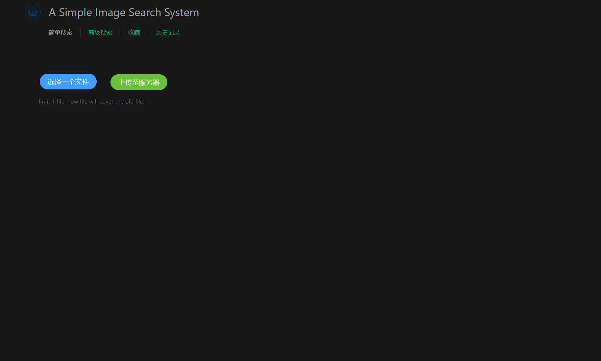
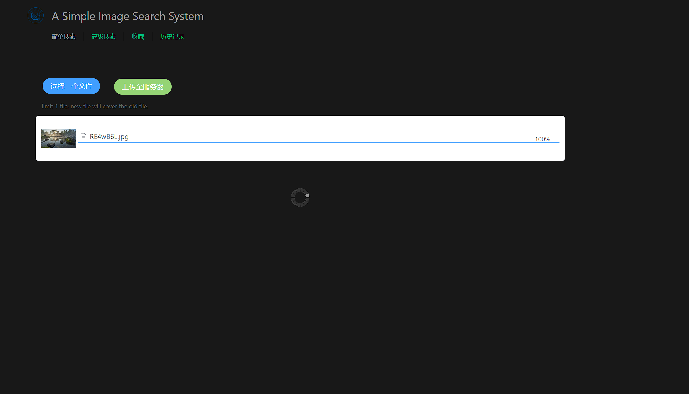
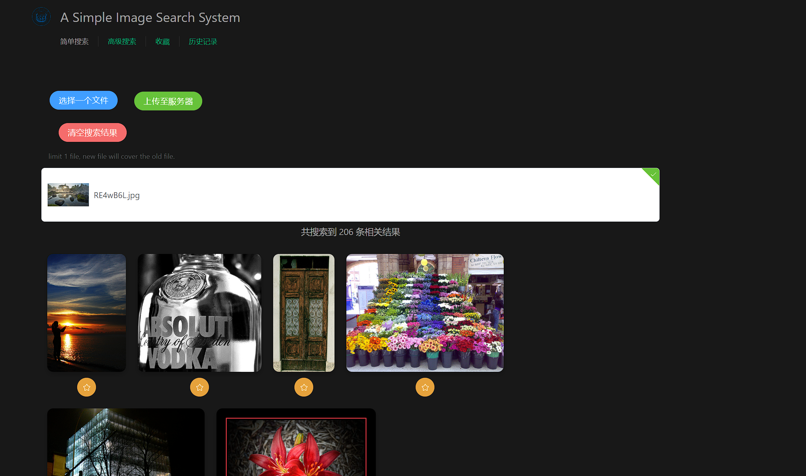
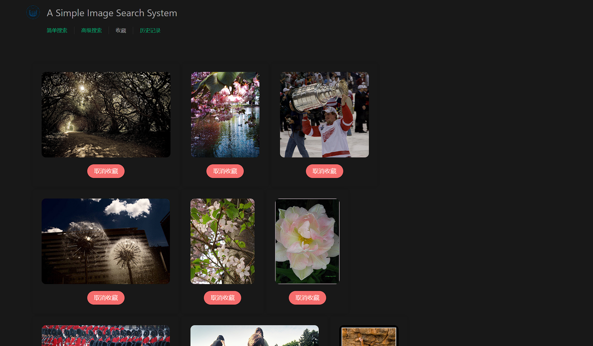
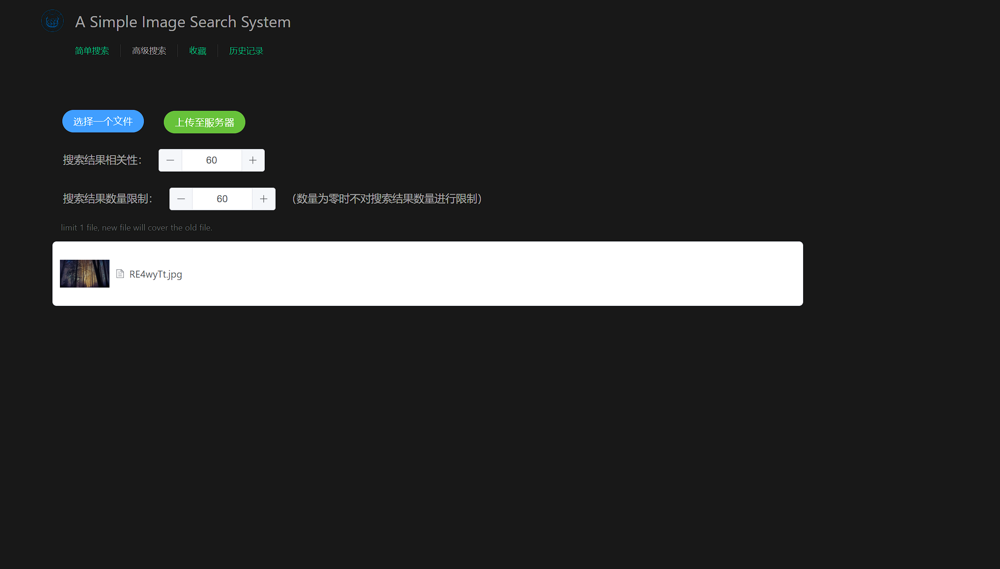
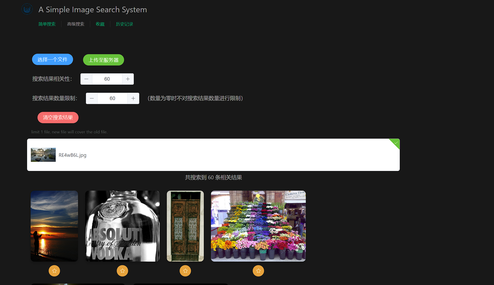

# A Simple Image Retrieval System

## Requirements Analysis

Formulation
Initiation of action
Review of results
Refinement
Use

## Features

- 按阈值呈现搜索结果
- 显示选中图片
- 收藏
- 高级查询：结果限定（结果数量、相关性强弱）
- 历史记录

## Implements

## Dependencies

The project consists of a image vectorizer to find similar images, a server using flask framework of python and some web page powered by vue, so you need to make sure there are python and node.js on your computer.

Then then following packages are required for training image vectorizer or building a server, you can install them by:

```bash
pip install numpy tensorflow scipy sklearn # for training or searching images
pip install Flask Flask-HTTPAuth # for server
```

The packages required by frontend will be installed in the next step autumatically.

## How To Run

To run the project, you need to train the vectorizer first, just run `image_vectorizer.py` using python.

After that, you need to generate the web pages using `node`. Just follow the steps:

```bash
# in the root directory of project
cd ./vue-template
npm install
npm run build
```

Then the preparation is over, back to the root directory and run the server by:

```bash
python ./rest-server.py
```

As you see `Running on http://127.0.0.1/5000`, the server is running, and open the link in your browser. You can start to enjoy the image searching server now!

## Screenshots








