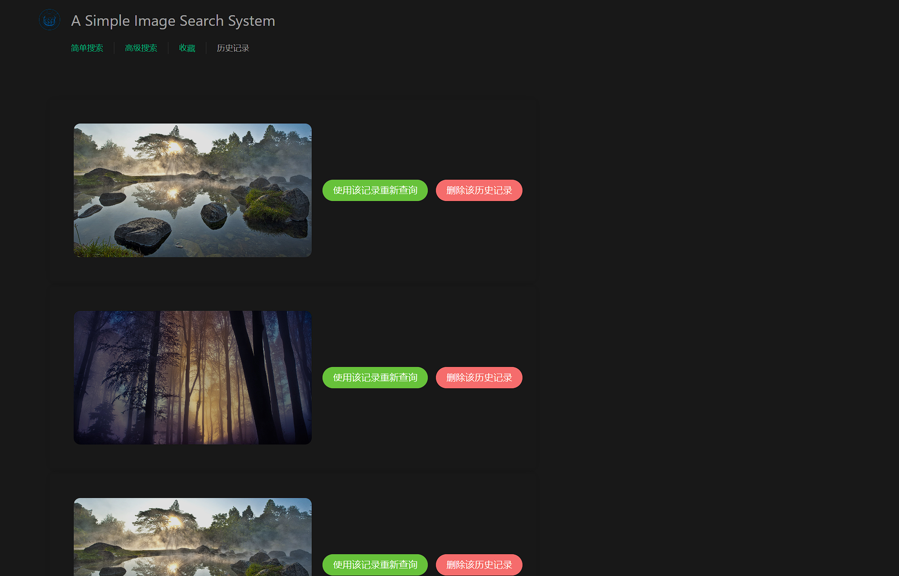

# A Simple Image Retrieval System

## Requirements Analysis

### Formulation

The system needs to be able to select images from the computer and upload them. And it can also control the size of the initial result set by setting the correlation and number of results. In addition, in this system, we should be able to also select some phrases to search for limited kinds of images. Unfortunately, limited to the power provided by models and absence of metadata for images, we can't provide the phrases constraints.

### Initiation of action

The system needs a "Check File" button and a search button. After clicking the search button, the relevant image should be displayed. And the design should be easy for users to complete their own search.

### Review of results

The system should provide an overview of results, such as total number. In addition, the results can be classified according to different categories. Users should also be able to change the order in which the results are displayed, such as chronological order.

### Refinement

The system should guide users in progressive refinement with meaningful messages. For image retrievaling using images, the most important and maybe only refinement is changing the search parameters. So we need to make it convenient as much as possible.

### Use

The system allows you to add images from searches to your favorites, and you can also unfavorite them from your favorites. It also allows you to view your search history and re-search for images in your search history.

## Design

### Formulation

Besides basic image uploading function, some restriction on the results are neccessary. Based on the model, we provide interfaces to upload image for retrievaling and restrict the results.

### Initiation of action

For a retrieval system, a upload button and a search button are neccessary. Addionally, we provide another page for advanced retrievaling, which contains two input fields to adjust the total number restriction of results and relevance.

### Review of results

After receiving the results of retrievaling, users can overview the total number of results. Limited to the absence of metadata, overview of categories will not be implemented.

### Refinement

And then users can adjust the parameters of retrievaling conveniently. If we had a fit model, we could be able to adjust the querying phrases, too.

### Use

The images uploaded and marked favorite can be found in another page and used in other ways users like.

## Features

- simple image retrievaling
- preview of image for searching
- advanced retrievaling
    - restrict the result number
    - restrict the relevance
- overview for results, such as total number
- record of the retrievaling history
- re-searching images using the retrievaling history
- favorite images and review them

## Implements

Based on the demo provided, we refactored the project and implement our new functions. The demo provides the simple retrievaling function, and we refactored it to reduce unnecessary file copy and add interface for new features. For example, we provide some interfaces to get uploaded images in `/uploads` and the images in database `/database/dataset`, which are not in static folder.

Powered by vue and element-plus framework, we beautified the upload buttons and added a preview of uploaded images.

Then by refactoring the `get_top_k_similar` function in `search.py`, we simplified the implement of this function and added some new parameters to restrict the searching results. Also, we added a routing interface named `newparameters` to pass the restrictions, which will be sent before `imgUpload` request.

After that, the frontend will receive a list of url of results formatted in json. It made it easy to count how many results are found and then provide the overview of the results.

Addionally, we remained the past uploaded images in the folder `/uploads` to implement the historical querying. When we need to requery the images in the history, we can just click the buttons in the history page. The implement of favorite images is similar. The difference between them is that the favorite images infomation are stored in a pickle file, which makes us easily edit our favorite images list.

## Dependencies

The project consists of a image vectorizer to find similar images, a server using flask framework of python and some web page powered by vue, so you need to make sure there are python and node.js on your computer.

Then then following packages are required for training image vectorizer or building a server, you can install them by:

```bash
pip install numpy tensorflow scipy sklearn # for training or searching images
pip install Flask Flask-HTTPAuth # for server
```

The packages required by frontend will be installed in the next step autumatically.

## How To Run

To run the project, you need to train the vectorizer first, just run `image_vectorizer.py` using python.

After that, you need to generate the web pages using `node`. Just follow the steps:

```bash
# in the root directory of project
cd ./vue-template
npm install
npm run build
```

Then the preparation is over, back to the root directory and run the server by:

```bash
python ./rest-server.py
```

As you see `Running on http://127.0.0.1/5000`, the server is running, and open the link in your browser. You can start to enjoy the image searching server now!

## Screenshots

Initial screen:


Wait for search results:


Presentation of results:


Favorite images presentation:


Advanced retrieval:


Review the query history:


